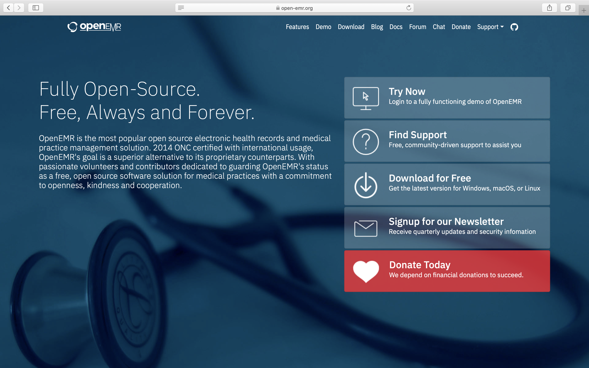

## Project Evaluation
During the project evaluation activity this week, our group was assigned [OpenEMR](https://www.open-emr.org/) , an open source software for electronic medical records and medical practice management as the project to be evaluated. I have always been interested in the combination of Computer Science and Health Administration, so I was very excited to look into OpenEMR. We first looked at the website of the project. The website of OpenEMR is very well-organized, and we were able to easily find everything we needed on the navigation bar and the footer. The website offers 3 fully functional demos to give visitors an idea of what the software is like. I tried one of the demos and it was very well built. There is an active forum where members of the community (both developers and users) post their questions. The website also provides links to the official Slack chat and the unofficial Telegram chat. The “Docs” tab links to a separate [OpenEMR Wiki](https://www.open-emr.org/wiki/index.php/OpenEMR_Wiki_Home_Page) site where demos, manuals, development info, etc. can be found. 

We then looked into the [GitHub repository](https://github.com/openemr/openemr) of OpenEMR. The most recent issue was created within the last hour, indicating that the project is quite active. The Code of Conduct file is very detailed, and if any unacceptable behavior is witnessed, it can be reported by sending admins a direct message on the community forum. The CONTRIBUTING.md file provides step-by-step guidelines of how to make code contributions. It also includes a link to the development policies on the wiki site where codes styles in different languages and development best practices are specified. The primary programming language of the project is PHP, a language that I have never used, but after looking into the source code, I found that it looked quite similar to Java, which I am familiar with. I also noticed that the documentation style can vary a lot among files. Some files have very detailed comments explaining each variable and method, while some files only have minimum documentation. But in general, most of the files in the repository are well-documented, and even beginners can understand the code after reading the comments. 

After investigating the website and the Github repository of the project, I believe that the OpenEMR community is friendly and welcoming to beginners, and OpenEMR will be a good project for someone who doesn’t have much experience with open source to work with. 

## Kevin P. Fleming Talk

This Wednesday, our guest speaking  [Kevin P. Fleming](https://www.linkedin.com/in/kpfleming/) from the CTO Office at Bloomberg gave us an informative talk on open source at Bloomberg. I didn’t know much about Bloomberg before the talk — Bloomberg News (the the subscription is kinda pricey imo), Bloomberg Terminal (looks like the interface is for experts only), and, maybe, Michael Bloomberg. 

  
   
    
Bloomberg Terminal (Travis Wise via flickr/ CC BY 2.0 )

